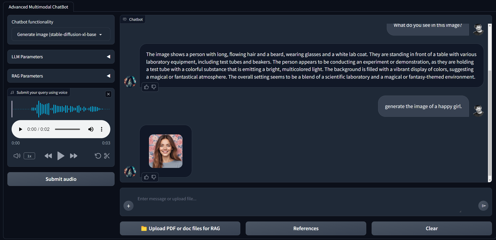

# Helmholtz Center for Environmental Research Chatbot Readme

Welcome to the Helmholtz Center for Environmental Research Chatbot! This guide will help you understand its capabilities and how to set it up.

## Helmholtz Center for Environmental Research Chatbot
<div align="center">
  
</div>

## Features:
- **ChatGPT-like Interaction:** Acts as a standard AI assistant.
- **Retrieval Augmented Generation (RAG):** Performs RAG in three different ways:
  1. With preprocessed documents
  2. With documents uploaded by the user during a session
  3. From any website requested by the user
- **Image Generation:** Utilizes a stable diffusion model to generate images.
- **Image Understanding:** Understands the content of images and answers user questions based on image content using the LLava model.
- **DuckDuckGo Integration:** Accesses the DuckDuckGo search engine to provide answers based on search results when needed.
- **Summarization:** Summarizes website content or documents upon user request.
- **Text and Voice Interaction:** Supports interaction through both text and voice inputs.
- **Memory:** Remembers previous queries during the current session to provide a more coherent interaction.

**Note:** This chatbot incorporates both the RAG-GPT and WebRAGQuery projects.


## Main underlying techniques used in this chatbot:
- LLM chains and agents
- GPT function calling
- Retrieval Augmented generation (RAG)

## Models used in this chatbot:
### Question and Answering Capabilities:
- GPT 3.5-turbo: [Website](https://platform.openai.com/docs/models) -- here we used Helmholtz base URL which was supported by Blablador [Website](https://strube1.pages.jsc.fz-juelich.de/2024-02-talk-lips-blablador/#/title-slide)
- It is possible to add your API as well, but you need to insert API-Key

- text-embedding-ada-002: [Website](https://platform.openai.com/docs/models)

### Image Understanding
- llava-hf/llava-1.5-7b-hf: [Website](https://huggingface.co/llava-hf/llava-1.5-7b-hf)  
- Note that different models have different syntaxes to work with! e.g. llava-hf/llava-v1.6-mistral-7b-hf [Website](https://huggingface.co/llava-hf/llava-v1.6-mistral-7b-hf) has different syntaxes on Huggingface
- I recommend you to downlaod the weights from huggingface hub and put it in your local directory! e.g. llava-1.5-7b-hf is [here](https://huggingface.co/llava-hf/llava-1.5-7b-hf/tree/main), 

 
### Image Generation

- stabilityai/stable-diffusion-xl-base-1.0 with LORA weights ByteDance/SDXL-Lightning : [Website](https://huggingface.co/stabilityai/stable-diffusion-xl-base-1.0), [Website] (https://huggingface.co/ByteDance/SDXL-Lightning)

### Automatic speech recognition (ASR) and speech translation

- openai/whisper-base.en: [Website](https://huggingface.co/openai/whisper-base.en)

## Requirements:
- Operating System: Linux OS or Windows Subsystem for Linux (WSL). Iused my institutational hardwares: Dell PowerEdge R940xa, Intel XEON Platinum 8280 / 4 * 28 Core + GPU NVIDIA Tesla V 100/32 GB -	Win2019 64 bit 
- GPU VRAM: Minimum 15 GB for full execution.
- OpenAI or Azure OpenAI Credentials: Required for GPT functionality.

## Installation and Usage:

- We highly recommend to frequently visit
	Pytorch[Website](https://pytorch.org/), 
	Huggingface[Wesite](https://huggingface.co/docs/transformers/en/installation),
	Openai[Website](https://pypi.org/project/openai/), for related package updates since updates make conflict!

- Ensure that you have a conda installation on your device! you may consider Minicaonda[Website](https://docs.anaconda.com/miniconda/#quick-command-line-install)

- Ensure you have Python installed along with required dependencies.

- If you use linux OS you may consider the following to install a new virtual environemnt and name it arbitrary

```bash
sudo apt update && sudo apt upgrade
python3 -m venv chatbot-env
git clone <the repository>
```

```
cd multi_llm
```
```
source ...Path to the environment/chatbot-env/bin/activate
```

- We recommend you to stick with Python version 3.10, abd create a following conda environemtn as follows:

```
conda create -n chatbot-env python=3.10
```

Then start to install the packages manually:


- No need to download model weights separately; all models are accessed directly from the HuggingFace hub.

## Execution:

To prepare Documents for RAG, Copy PDF files to `data/docs` directory and execute:
```
python src/prepare_vectordb_from_docs.py.
```

### Chatbot one-Click Execution:
Run the provided script: 
```
./run_chatbot.sh
```
### Accessing the Chatbot UI:
Visit http://127.0.0.1:7860 in your web browser after executing the command.

### Stopping the Chatbot:
- Detach from Session:
Press Ctrl + b, then release both keys and press d.
- To terminate Session in the terminal, execute: 
```
tmux kill-session -t chatbot
```

### Manual Execution:
Terminal One: RAG Reference Service
```
python src/utils/web_servers/rag_reference_service.py
```
Terminal Two: LLava Service
```
python src/utils/web_servers/llava_service.py
```
Terminal Three: Stable Diffusion Service
```
python src/utils/web_servers/sdxl_service.py
```
Terminal Four: Speech-to-Text Service
```
python src/utils/web_servers/stt_service.py
```
Launch Chatbot Interface in terminal five:
```
python src/app.py
```
or
```
gradio src/app.py
```

## Chatbot User Interface
<div align="center">
  
</div>


## Project Schema
<div align="center">
  
</div>

## Key frameworks/libraries used in this chatbot:
- Langchain: [introduction](https://python.langchain.com/docs/get_started/introduction)
- Duckduckgo search engine: [Documentation](https://pypi.org/project/duckduckgo-search/)
- Gradio: [Documentation](https://www.gradio.app/docs/interface)
- OpenAI: [Developer quickstart](https://platform.openai.com/docs/quickstart?context=python)
- Transformers: [Documentation](https://huggingface.co/docs/transformers/en/index)
- chromadb: [Documentation](https://docs.trychroma.com/)
- bs4: [Documentation](https://beautiful-soup-4.readthedocs.io/en/latest/)