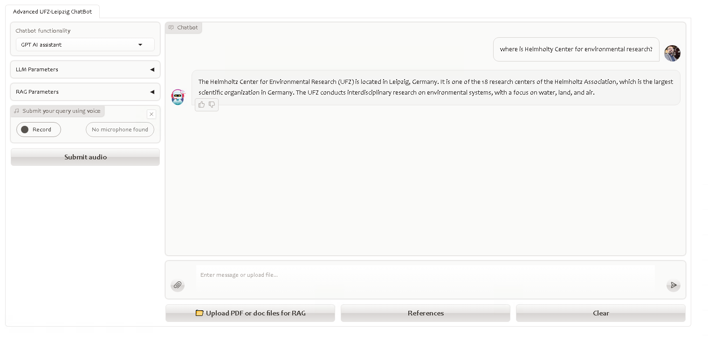
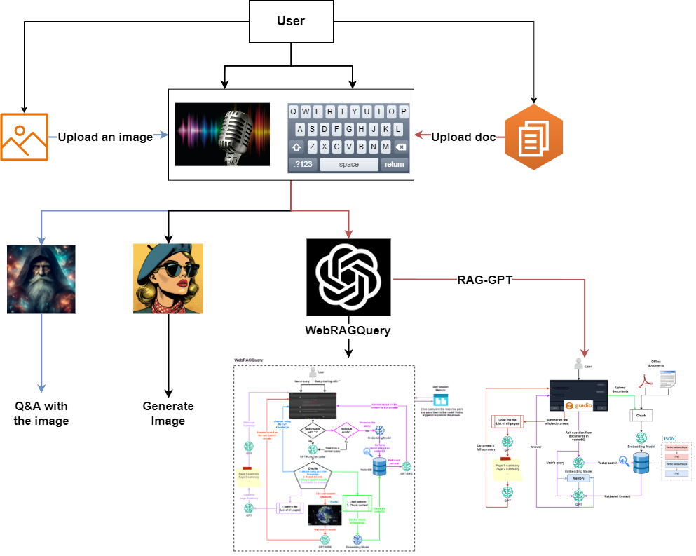

# Helmholtz Center for Environmental Research Chatbot Readme

Welcome to the Helmholtz Center for Environmental Research Chatbot! This guide will help you understand its capabilities and how to set it up.

## Helmholtz Center for Environmental Research Chatbot
<div align="center">
  
</div>

## Features:
- **ChatGPT-like Interaction:** Acts as a standard AI assistant.
- **Retrieval Augmented Generation (RAG):** Performs RAG in three different ways:
  1. With preprocessed documents
  2. With documents uploaded by the user during a session
  3. From any website requested by the user
- **Image Generation:** Utilizes a stable diffusion model to generate images.
- **Image Understanding:** Understands the content of images and answers user questions based on image content using the LLava model.
- **DuckDuckGo Integration:** Accesses the DuckDuckGo search engine to provide answers based on search results when needed.
- **Summarization:** Summarizes website content or documents upon user request.
- **Text and Voice Interaction:** Supports interaction through both text and voice inputs.
- **Memory:** Remembers previous queries during the current session to provide a more coherent interaction.

**Note:** This chatbot incorporates both the RAG-GPT and WebRAGQuery projects.


## Main underlying techniques used in this chatbot:
- LLM chains and agents
- GPT function calling
- Retrieval Augmented generation (RAG)

## Models used in this chatbot:
### Question and Answering Capabilities:
- GPT 3.5-turbo: [here](https://platform.openai.com/docs/models) -- here we used Helmholtz base URL which was supported by Blablador [here](https://strube1.pages.jsc.fz-juelich.de/2024-02-talk-lips-blablador/#/title-slide)
- It is possible to add your API as well, but you need to insert API-Key

- text-embedding-ada-002: [here](https://platform.openai.com/docs/models)

### Image Understanding
- llava-hf/llava-1.5-7b-hf: [here](https://huggingface.co/llava-hf/llava-1.5-7b-hf)  
- Note that different models have different syntaxes to work with! e.g. llava-hf/llava-v1.6-mistral-7b-hf [here](https://huggingface.co/llava-hf/llava-v1.6-mistral-7b-hf) has different syntaxes on Huggingface
- I recommend you to downlaod the weights from huggingface hub and put it in your local directory! e.g. llava-1.5-7b-hf is [here](https://huggingface.co/llava-hf/llava-1.5-7b-hf/tree/main), 

 
### Image Generation

- stabilityai/stable-diffusion-xl-base-1.0  [here](https://huggingface.co/stabilityai/stable-diffusion-xl-base-1.0), with LORA weights ByteDance/SDXL-Lightning : [here](https://huggingface.co/ByteDance/SDXL-Lightning)
- I recommend you to downlaod the weights from huggingface hub and put it in your local directory! stable-diffusion-xl-base-1.0 [here](https://huggingface.co/stabilityai/stable-diffusion-xl-base-1.0/tree/main) and
 ByteDance/SDXL-Lightning [here](https://huggingface.co/ByteDance/SDXL-Lightning/tree/main)
- Please consider that while zou are downloading the files never change their names! since the models are sensitive to the names! if during the download somehow they changed re-name them to their original name later on!


### Automatic speech recognition (ASR) and speech translation

- openai/whisper-base.en: [here](https://huggingface.co/openai/whisper-base.en)
- I recommend you to downlaod the weights from huggingface hub and put it in your local directory! e.g. whisper-base.en [here](https://huggingface.co/openai/whisper-base.en/tree/main)

## Requirements:
- Operating System: Linux OS or Windows Subsystem for Linux (WSL). Iused my institutational hardwares: Dell PowerEdge R940xa, Intel XEON Platinum 8280 / 4 * 28 Core + GPU NVIDIA Tesla V 100/32 GB -	Win2019 64 bit 
- GPU VRAM: Minimum 15 GB for full execution.
- OpenAI or Azure OpenAI Credentials: Required for GPT functionality.

## Installation and Usage:

- We highly recommend to frequently visit for related package updates since updates make conflict!
	Pytorch [here](https://pytorch.org/), 
	Huggingface [here](https://huggingface.co/docs/transformers/en/installation),
	Openai [here](https://pypi.org/project/openai/),
	Langchain [here](https://python.langchain.com/v0.1/docs/get_started/installation/)
	Langchain-community [here](https://pypi.org/project/langchain-community/)

 

- Ensure that you have a conda installation on your device! you may consider Minicaonda[here](https://docs.anaconda.com/miniconda/#quick-command-line-install)

- Ensure you have Python installed along with required dependencies.

- If you use linux OS you may consider the following to install a new virtual environemnt and name it arbitrary

```bash
sudo apt update && sudo apt upgrade
python3 -m venv chatbot-env
git clone <the repository>
```

```
cd multi_llm
```
```
source ...Path to the environment/chatbot-env/bin/activate
```

- We recommend you to stick with Python version 3.10, abd create a following conda environemtn as follows:

```
conda create -n chatbot-env python=3.10
```


Here they are the steps that I have done for Windows OS! 

Open the cmd and brows to the directoty that you have installed the conda! e.g
 
```
S:\Users\forootan\miniconda3\Scripts\activate
```

remember in / and \ differs in Linux and Windows!

by now you should see s.th. like this ```(base) S:\>``` means that you activated the conda base environemnt!

then type ```conda activate multi_llm```


#### Then start to install the packages manually:

```
pip3 install torch torchvision torchaudio --index-url https://download.pytorch.org/whl/cu118
pip install 'transformers[torch]'
pip install openai
pip install langchain
pip install langchain-community
pip install accelerate
pip install uvicorn
pip install tiktoken
pip install bitsandbytes
pip install pyprojroot
pip install gradio
```


You can use your custome IDE but I used Spyder(```pip install spyder```) or conda-forge channel [here](https://anaconda.org/conda-forge/spyder) ```conda install conda-forge::spyder``` 


- If you have enough hard drive you can go for autoamtic downlaod and no need to download model weights separately; all models are accessed directly from the HuggingFace hub.

## Execution:

- you can find the details of settigns in folder ```multi_llm-main\configs``` that you need to modify the content of .txt files as you desire!


e.g. the `rag_gpt` has directory settings: 

```text
directories:
  data_directory: data\docs
  data_directory_2: data\docs_2
  persist_directory: data\vectordb\processed\chroma\
  custom_persist_directory: data\vectordb\uploaded\chroma\
```

these paths are required for the running of the process!


or `webragquery` has the following content!


```text
llm_function_caller:
  gpt_model: gpt-3.5-turbo
  temperature: 0
  system_role:
    "As a chatbot, your goal is to respond to the user's question respectfully and concisely.
    Feel free to answer the user from your own knowledge.
    However, if the user's query needs to be answered by searching over the internet, return the best fuction to serve the user from the provided functions.\
    "
```


To prepare Documents for RAG, Copy PDF files to `data\docs` directory and execute:
```
python src\prepare_vectordb_from_docs.py
```


### Manual Execution:
Terminal One: RAG Reference Service
```
python src\utils\web_servers\rag_reference_service.py
```
Terminal Two: LLava Service
```
python src\utils\web_servers\llava_service.py
```
Terminal Three: Stable Diffusion Service
```
python src\utils\web_servers\sdxl_service.py
```
Terminal Four: Speech-to-Text Service
```
python src\utils\web_servers\stt_service.py
```
Launch Chatbot Interface in terminal five:
```
python src\app.py
```


## Chatbot User Interface
<div align="center">
  
</div>


## Project Schema
<div align="center">
  
</div>

## Key frameworks/libraries used in this chatbot:
- Langchain: [introduction](https://python.langchain.com/docs/get_started/introduction)
- Duckduckgo search engine: [Documentation](https://pypi.org/project/duckduckgo-search/)
- Gradio: [Documentation](https://www.gradio.app/docs/interface)
- OpenAI: [Developer quickstart](https://platform.openai.com/docs/quickstart?context=python)
- Transformers: [Documentation](https://huggingface.co/docs/transformers/en/index)
- chromadb: [Documentation](https://docs.trychroma.com/)
- bs4: [Documentation](https://beautiful-soup-4.readthedocs.io/en/latest/)